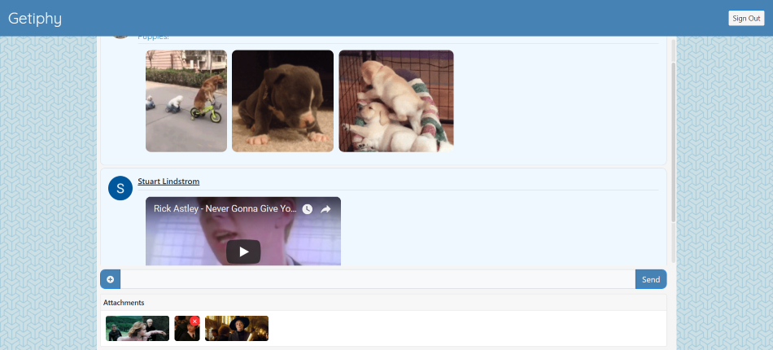

# [Getiphy](https://getiphy.herokuapp.com/)

### Description and Usage
Getiphy is a chatroom app with [Giphy](https://giphy.com/) and [Youtube](https://www.youtube.com/) integration. Anyone can view recent messages, but in order to send messages, users must log in with google, which allows the app to use their name and photo. Once that's been done, they can send as many messages as they want. The '+' button beside the text input will bring up a menu that allows users to search giphy and youtube for gifs and videos to embed in their message. Up to 3 gifs and 2 videos can be added to a single message. Before the message is sent, gif and video attachments can be removed from the message by hovering over the preview and pressing the red 'x' button that appears in the corner of the preview.

### Libraries and Tech Used
- [Node.js](https://nodejs.org/)
- [Socket.io](https://socket.io/)
- [Bootstrap 4](https://getbootstrap.com/)
- [Javascript ES6](https://www.javascript.com/)
- [jQuery](https://jquery.com/)
- [NPM](https://www.npmjs.com/)
- [Github](https://github.com/)
- [Heroku](https://www.heroku.com/)
- [Google Sign-In](https://developers.google.com/identity/sign-in/web/sign-in)
